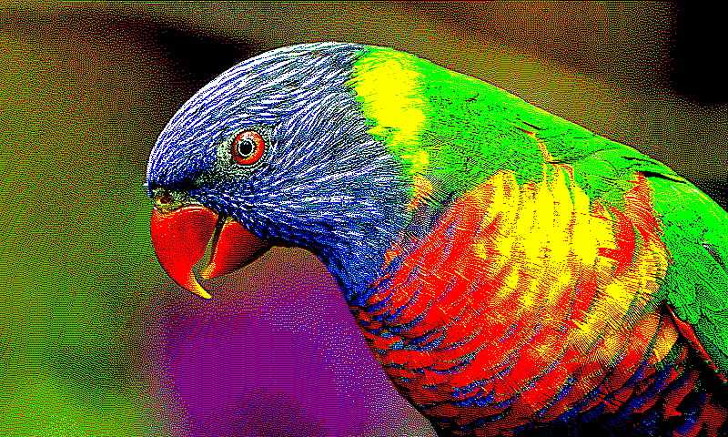
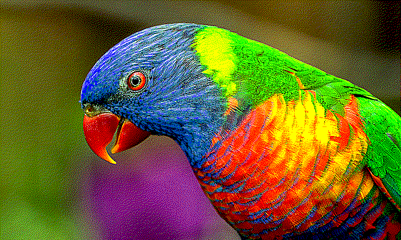
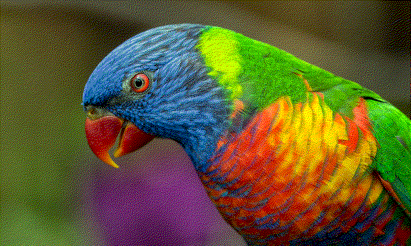
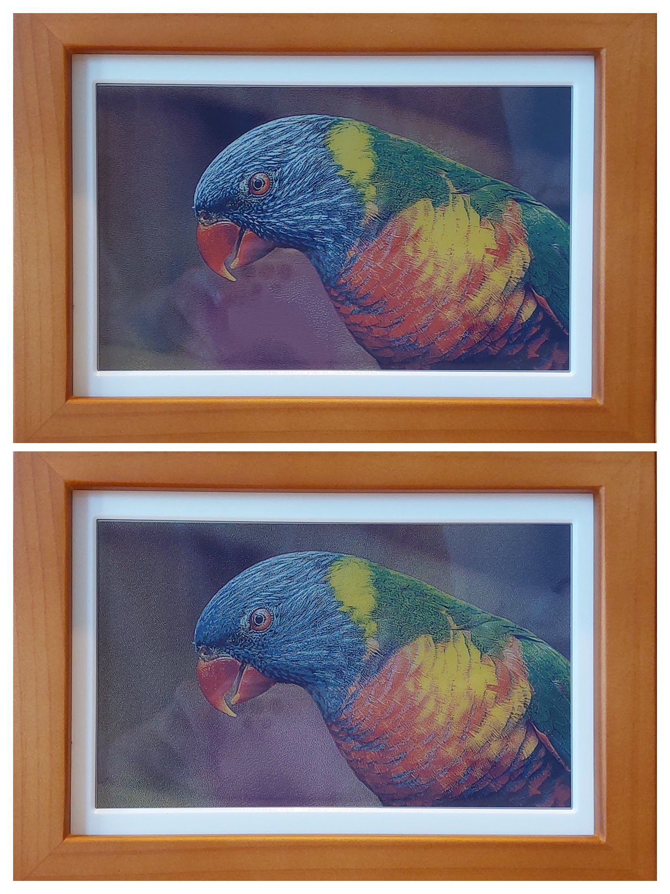

# E-Ink Spectra 6 Image Converter

This script converts images for display on a 6-color e-ink screen, optimizing them for such displays. Having bought a PhotoPainter Photo Frame (https://www.waveshare.com/PhotoPainter-B.htm) I was not so pleased with the supplied conversion script. Hence i made this version.

<div style="width:30%; margin: auto;">


</div>

## Purpose

E-ink screens have unique color limitations and characteristics. This converter aims to process standard image files (like JPG, PNG, HEIC) and transform them into a format suitable for the Waveshare 7.3inch E6 Full Color E-Paper e-ink display. 

## Features:

*   **Color Quantization**: Reducing the image's color palette to the 6 specific colors supported by the e-ink screen.
*   **Dithering**: Applying dithering algorithms to simulate intermediate colors and improve perceived detail.
*   **Added Atkinson Dithering**: Unlike Floyd–Steinberg dithering, it has a more localized dither, creating more visually pleasing pictures. It is much slower.
*   **Resizing and Cropping**: Adjusting image dimensions to match the e-ink display's resolution (1600x1200 or 1200x1600) while maintaining aspect ratio.
*   **Image Enhancements**: Applying adjustments like brightness, contrast, and saturation to make the image appear more vibrant and clear on the e-ink display. Adjusted the relative contribution of rgb_dist vs luma_dist, so that hue errors are more important. Also tuned the Weight compensation in distance metric.
*   **HEIC Support**: Enabling the processing of HEIC image files.
*   **Progress Bar**: for folder processing, especially handy for large numbers of files.

## Comparison

### Atkinson Dithering
  
### Floyd-Steinberg Dithering (this script )

### Floyd-Steinberg Dithering (original Waveshare implementation)


### Atkinson Dithering
  
### Floyd-Steinberg Dithering  
  
### Floyd-Steinberg Dithering (original Waveshare implementation)


### Real life comparison Atkinson Dithering on top, Floyd-Steinberg Dithering below  
  
Photographing the Photopainter frame without reflections is challenging, so this image doesn't fully capture the real-life appearance but provides a general idea. Note that the images appear oversaturated on computer displays, but this is to compensate for the e-ink display's characteristics.

My advice:

*Use Atkinson dithering for portraits, it gives a more localized, visually pleasing effect with less pattern repetition.*

*Use Floyd-Steinberg dithering for art, it uses global error diffusion, giving more uniform noise but is more color correct.*
## Source Examples

This script is a combination and enhancement of two existing scripts found in /inspiration: `convert-program1.py` (source: https://www.waveshare.com/wiki/PhotoPainter_(B)#Picture_Production) and `convert-program2.py` (source: https://github.com/myevit/PhotoPainter_image_converter).


## Usage

A prebuilt windows .exe is supplied. Just drag and drop image files or a folder.

1.  **Install Dependencies**:
    ```bash
    pip install -r requirements.txt
    ```

2.  **Convert a single image**:
    ```bash
    python ConvertTo6ColorsForEInkSpectra6.py path/to/your/image.jpg
    ```

3.  **Convert all images in a directory**:
    ```bash
    python ConvertTo6ColorsForEInkSpectra6.py path/to/your/images/directory
    ```

4.  **Use specific options**:
    ```bash
    python ConvertTo6ColorsForEInkSpectra6.py images/my_photo.jpg --mode cut --contrast 1.5 --saturation 1.1 --dither 3
    ```

5.  **Convert for SwitchBot AI Canvas 13.3 inch** (portrait, 1200×1600):
    ```bash
    python ConvertTo6ColorsForEInkSpectra6.py images/my_photo.jpg --switchbot-133
    ```

6.  **Convert for SwitchBot AI Canvas 13.3 inch in landscape orientation** (1600×1200):
    ```bash
    python ConvertTo6ColorsForEInkSpectra6.py images/my_photo.jpg --switchbot-133 --dir landscape
    ```

## Implementation Details

### Atkinson Dithering
The current Atkinson dithering implementation uses a simplified forward-only error distribution approach for speed. Error is only distributed to not-yet-processed pixels (right and down directions) with the following weights:
- Right: 1/8
- Bottom-left: 1/8  
- Bottom: 1/4
- Bottom-right: 1/8

This results in a total error distribution of 5/8, which is characteristic of Atkinson dithering. The forward-only approach provides memory efficiency by avoiding the need to store the entire image for error diffusion and enables single-pass processing. This differs from the standard 6-pixel Atkinson algorithm which typically distributes error to 6 surrounding pixels (including right-right and bottom-bottom positions) each with 1/8 weight.

### Color Distance Metric
I explored adding a custom color palette. Not assuming red #FF0000, yellow #FFFF00, green #00FF00, blue #0000FF — like monitor primaries, but rather the actual colors on the display are more muted than that, where particularly blue and green are quite a bit shifted (based on this post: https://forums.pimoroni.com/t/what-rgb-colors-are-you-using-for-the-colors-on-the-impression-spectra-6/27942). I could not get this to work satisfyingly, so i opted to compensate it with the color quantization algorithm, which uses a custom distance metric that combines RGB and luminance components with carefully tuned weights to optimize for e-ink display characteristics and human visual perception:

- **Custom Luma Calculation**: Uses a weighted formula (R×250 + G×350 + B×400) instead of standard luminance, emphasizing green and blue sensitivity which is important for e-ink displays.

- **RGB Distance Weights**: The RGB component distance uses asymmetric weights (R:0.250, G:0.350, B:0.400) with an overall scaling factor of 0.75, which boosts blue visibility and reduces red emphasis to compensate for display limitations.

- **Priority on Hue Accuracy**: The total distance formula (1.5×rgb_dist + 0.60×luma_dist) intentionally weights RGB differences more heavily than luminance differences (1.5 vs 0.60), making hue errors more significant than brightness errors. This prevents color shifting and maintains color fidelity on the limited palette.

- **Human Eye Compensation**: The weights account for human eye sensitivity to different colors (more sensitive to green, less to red) and the specific color rendering characteristics of e-ink Spectra 6 displays.

## Future Improvements

*   **Color Shifting Issue**: While the compensated palette now includes monitor primaries as anchors, highly saturated colors might still occasionally shift hue (with Atkinson) due to the nature of color quantization. Further fine-tuning of the palette or exploring alternative quantization algorithms could improve this. For example, a very saturated red, like `#FF0000` (RGB: 255, 0, 0), is numerically very different from our compensated red, `#a02020` (RGB: 160, 32, 32). The distance is large. At the same time, our compensated blue, `#5080b8` (RGB: 80, 128, 184), is also far away, but depending on the exact shade of red in the original image, it's possible that the distance to blue is smaller than the distance to red. Investigating perceptual color spaces (like CIELAB) for distance calculations might yield better results.
*   **Other Dithering methods**: Eg: Joel Yliluoma's arbitrary-palette positional dithering algorithm ( https://bisqwit.iki.fi/story/howto/dither/jy/ )

## License
This project is open source and available under the MIT License.
Images found under /samples are Unsplash licensed.
